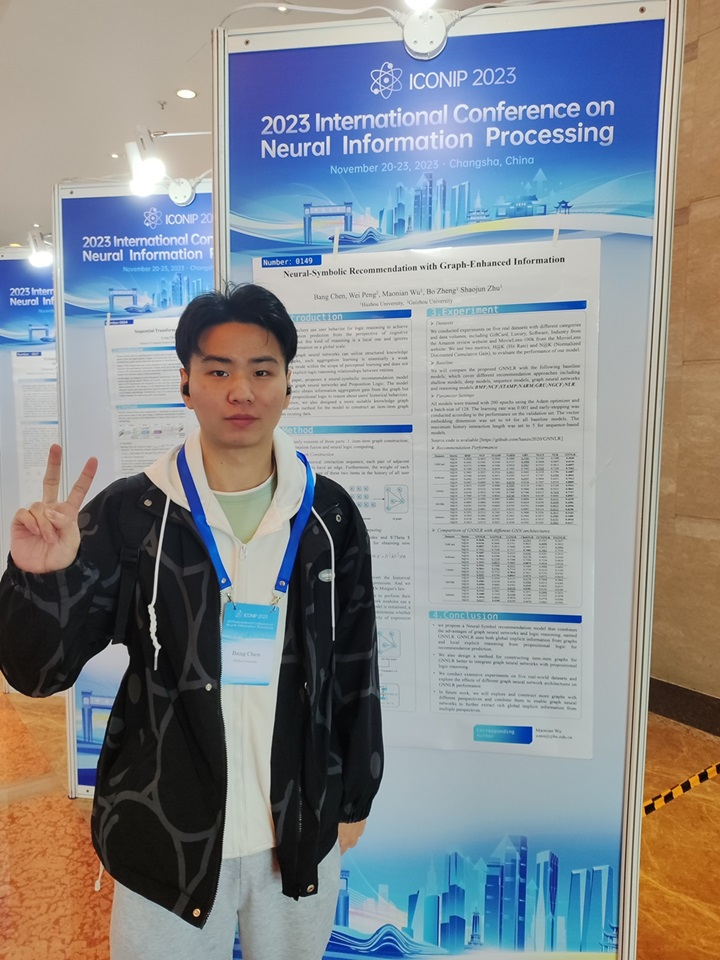
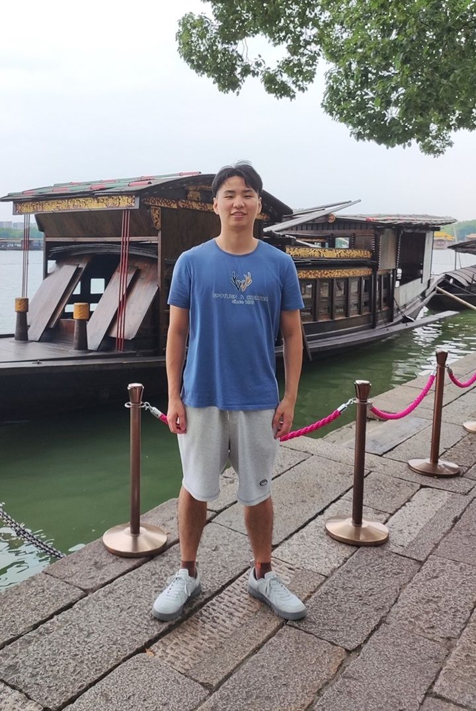
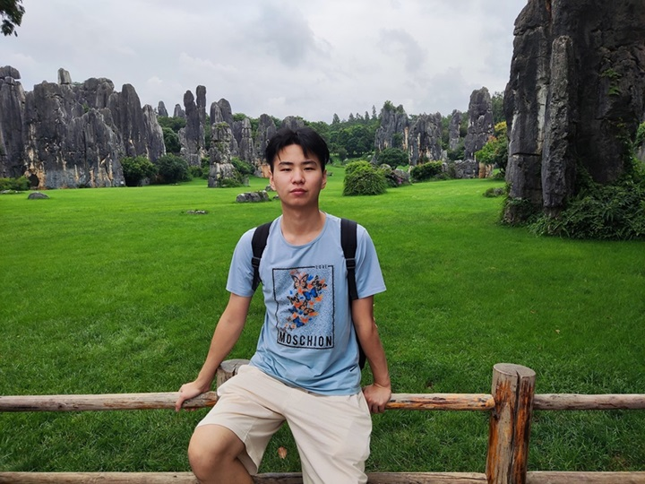

# 关于我

陈邦，浙江杭州人，1999.4年出生。高中就读于杭州市西湖高级中学，本科就读于桂林理工大学，硕士就读于湖州师范学院，硕士师从吴茂念教授。

---

## 最新动态

- **最后更新时间：2023.12**
- 2023.12：论文"Neuro-Symbolic Recommendation Model based on Logic Query"被 Knowledge-based systems 录用 (SCI，中科院1区Top)
- 2023.11：感谢朱绍军老师引荐，已有博导愿意接收
- 2023.10：恭喜自己，很突然且侥幸的获得了本年度硕士国家奖学金
- 2023.07：论文"Neural-Symbolic Recommendation with Graph-Enhanced Information"被 ICONIP 2023 录用（CCF Rank C）
- 2023.07：论文"Artificial intelligence assisted pterygium diagnosis: current status and perspectives"被 International Journal of Ophthalmology 录用（SCI，中科院 3 区）
- 2022.12：在KRW2022上作口头报告 [报告PPT](./file/KRW2022-BangChen.pdf)
- 2022.08：在 International Conference on AI Logic and Applications 会议上作口头报告 [报告PPT](./file/AILA-5-BangChen.pdf)
- 2022.06：论文"Predicate Logic Network: Vision Concept Formation"被 International Conference on AI Logic and Applications 录用
- 2022.04：论文"融合命题逻辑与神经网络的隐式深度协同推荐模型"被 计算机应用研究 录用（北大核心，CCF Rank C 中文期刊）

---

## 珍贵影像

2023.11 长沙 ICONIP2023会议

2023.10 嘉兴

2021.7 云南

 

## 学术背景

**[已与博导达成意向，不再报名其他学校] 我正在寻找2024秋季攻读博士的机会**

- 本科[GPA-3.5，一次二等奖学金，一次三等奖学金，优秀毕业论文]
- **2017.9 - 2018.6:** 桂林理工大学    材料类
- **2018.9 - 2021.6:** 桂林理工大学    电子商务(转专业)
- 硕士[一次国家奖学金，两次一等奖学金，优秀毕业研究生]
- **2021.9 - 2024.6:** 湖州师范学院    计算机技术

 

---

## 研究方向与兴趣

- Neural-Symbolic System
- Knowledge Representation and Reasoning
- Recommendation System

现实原因，上述方向没有找到确定录取的博导，目前明确接收的博导研究方向为医学影像三维重构，希望能做出一些有用的东西

 

---
